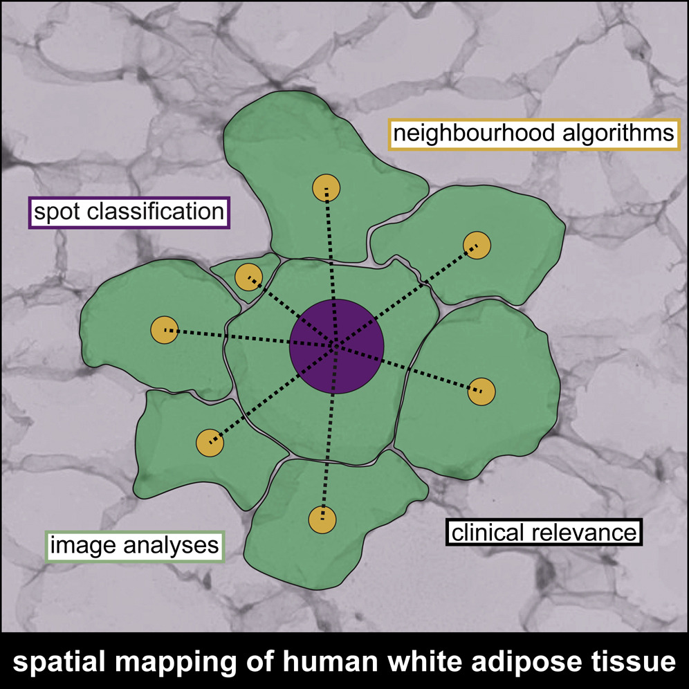

# neighborhood Analysis

    

 
 

**neighborhood Analysis** is a [latch.bio](https://latch.bio/) workflow for generating R objects and data for downstream analysis of epigenomic [Neighborhood Analysis](https://www.cell.com/cell-metabolism/fulltext/S1550-4131(21)00363-6?_returnURL=https%3A%2F%2Flinkinghub.elsevier.com%2Fretrieve%2Fpii%2FS1550413121003636%3Fshowall%3Dtrue#secsectitle0010).

> This workflow does not support combined feature count matrices with > 2^31 - 1 elements (~100,000 cells); we are working to add support for large matrices in a future version. 

## Inputs
workflow takes the following parameters:

* Seurat object file: A seurat object created by [create ArchRProject](https://github.com/atlasxomics/archrproject_latch/tree/main) workflow per sample

* [tissue_positions_list.csv](https://docs.atlasxomics.com/projects/AtlasXbrowser/en/latest/SpatialFolder.html): A comma-separated file in which each row contains a unique barcode, an indicator for whether the tixel is 'on-tissue' (1, 0), and a row/column index

* [Spatial folder](https://docs.atlasxomics.com/projects/AtlasXbrowser/en/latest/SpatialFolder.html): A directory containing tissue images and experiment metadata

* Run ID: An identifier for the run

* Condition (_optional_):  An experimental Condition descriptor (ie. 'control', 'diseased')

Individual runs are batched in a Project with the following global parameters,

* Project Name: A name for the output folder

* Genome: A reference genome to be used for alignment

* Upload to SLIMS _(ATX-internal only)_: A T/F toggle for whether to push QC results to LIMS

## Running the workflow (_in progress_)

## Outputs (_in progress_)

## Next Steps

## Support
Questions? Comments?  Contact support@atlasxomics.com or post in AtlasXomics [Discord](https://discord.com/channels/1004748539827597413/1005222888384770108).
